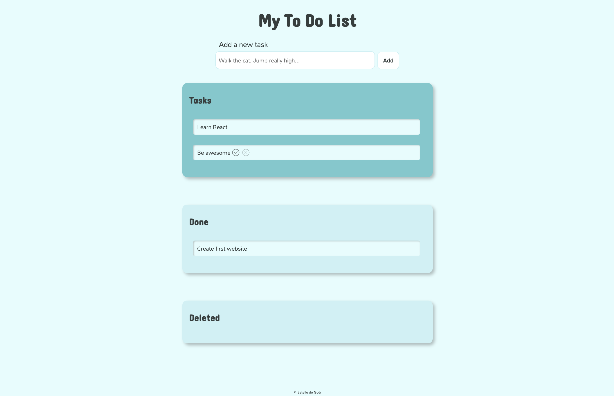

# To Do List : first Javascript project 

Ma première phase d'apprentissage du développement web est autotidacte. Pour consolider ma compréhension de Javascript, j'ai décidé de créer sans plus attendre un premier site. 

La To Do List est un premier exercice évident pour se faire la main sur un certain nombre de fonctionnalités de base. 

Principaux éléments mis en place : 
* Formulaire avec bouton Submit
* Event Listener sur le bouton Submit permettant d'ajouter les nouvelles tâches
* Message d'erreur si le champ "Add a new task" est vide
* Ajout en JS de paragraphes dans les conteneurs Tasks, puis Done et Deleted
* Ajout de boutons de déplacement vers les autres catégories, qui apparaissent en hover uniquement, et sont supprimés lorsque la tâche est déjà dans la catégorie correspondante
* Gestion des tâches par le Local Storage

Le projet est encore en cours et connaîtra des fonctionnalités supplémentaires, comme la suppression définitive des tâches.

Le design est minimal et peut évoluer ponctuellement, néanmoins ce projet existe en priorité pour pratiquer avec JS.

